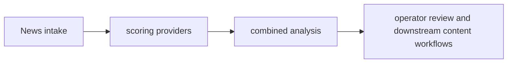

# News Intelligence Engine — Project Brief

## At a glance

| Field | Value |
|---|---|
| Portfolio area | AI and market intelligence |
| Repository | [jjshay/intelligence-engine](https://github.com/jjshay/intelligence-engine) |
| Status | Source available; runtime not revalidated in this documentation review |
| Evidence review | 2026-09-11; [commit b80bc15](https://github.com/jjshay/intelligence-engine/tree/b80bc15394a3587f31226cdb5f5b20b5f54b05db) |

## Problem and intended value

News triage needs a repeatable way to compare relevance and model disagreement.

The intended value is a repeatable workflow whose inputs, transformations, and outputs can be inspected. Use the evidence below to distinguish implementation from business outcomes.

## Architecture and data flow

News intake → scoring providers → combined analysis → operator review and downstream content workflows.

## Implementation evidence

| Source | Reading purpose |
|---|---|
| [process_news_in.py](../process_news_in.py) | Implementation component supporting the data flow described above. |
| [fetch_news.py](../fetch_news.py) | Implementation component supporting the data flow described above. |
| [tests/test_scoring.py](../tests/test_scoring.py) | Behavioral test source; inspect fixtures and assertions before interpreting coverage. |

The links above point to the current repository. The review reference identifies the version used to prepare this brief.

## Setup and operation

Use the existing [README](../README.md) for setup and operating commands. Configuration and dependency references: [requirements.txt](../requirements.txt), [pyproject.toml](../pyproject.toml), [.env.example](../.env.example).

Start with sample or fixture inputs. Where external services are involved, configure a test account and check the distinction between a local preview, a generated artifact, and a remote write. Credentials and operational datasets are environment-specific.

## Validation and outcomes

**Review result:** Repository tree and referenced source reviewed. Existing application tests, hosted deployments, paid providers, and external mutations were not re-run in this documentation review.

Test sources found: [tests/test_scoring.py](../tests/test_scoring.py). Their presence does not mean the suite was run in this review.

The source implements the workflow described above. No new revenue, accuracy, conversion, or production-uptime result is asserted by this documentation update.

Documentation itself is checked by `python3 scripts/check_project_docs.py`; that check validates this structure and its source references, not application behavior.

## Decisions and limitations

Model diversity can expose different interpretations; agreement does not establish factual correctness.

Keep provider-dependent observations dated and separate from deterministic transformations. State which assumptions a demonstration uses and which integrations it actually exercises.

## Interview talking points

- **Problem and product judgment:** Explain why this workflow mattered to its intended operator: News triage needs a repeatable way to compare relevance and model disagreement.
- **Technical walkthrough:** Trace one concrete input through this sequence: News intake → scoring providers → combined analysis → operator review and downstream content workflows.
- **Engineering tradeoff:** Model diversity can expose different interpretations; agreement does not establish factual correctness.
- **Evidence and ownership:** Open the source links above, identify the specific design or implementation decisions you personally drove, and distinguish AI-assisted implementation from measured operating results.
- **What comes next:** Compare rankings with a human-labeled article set, recording provider versions, missing responses, and evaluation dates.

## Next improvements

Compare rankings with a human-labeled article set, recording provider versions, missing responses, and evaluation dates.

Record any follow-up result with a date, exact command or evaluation method, input scope, observed output, and limitations. Update `project.json` alongside this brief.

## Related projects

- [TradeRadar](https://github.com/jjshay/TradeWatch) — AI and market intelligence.
- [AI Book](https://github.com/jjshay/ai-book) — AI and market intelligence.
- [AI Book Updater](https://github.com/jjshay/ai-book-updater) — AI and market intelligence.
- [Market Briefing and Alerts](https://github.com/jjshay/jj-market-alert) — AI and market intelligence.

Some related repositories require authorized GitHub access.
